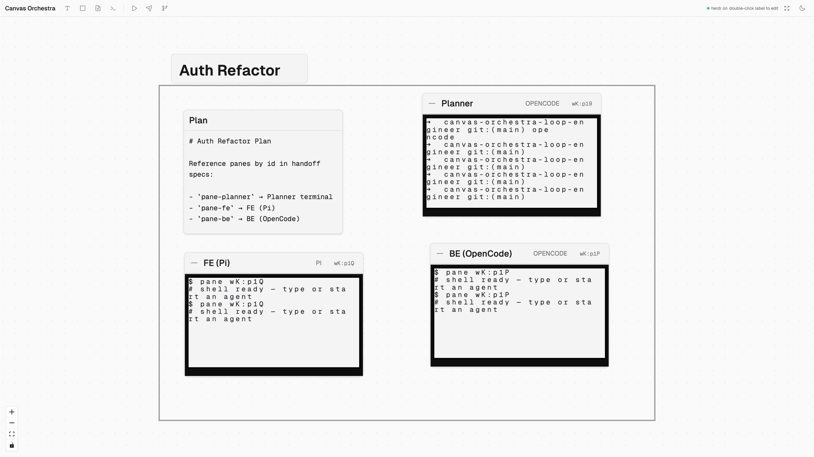
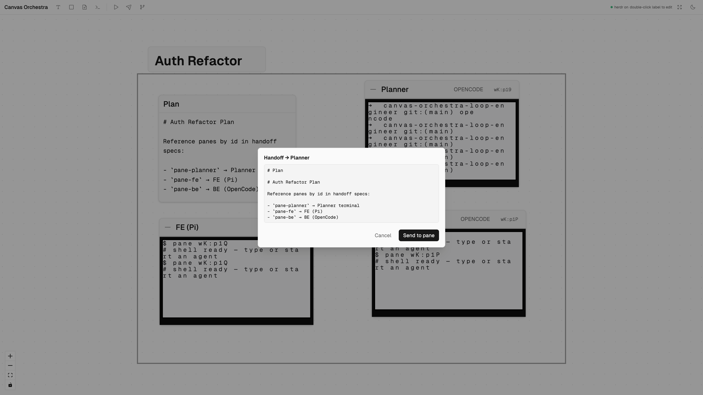
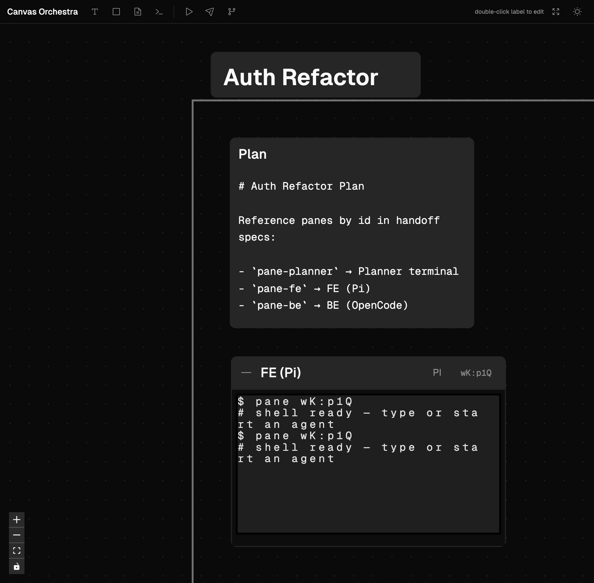

# Canvas Orchestra

Visual workflow canvas for orchestrating AI coding agents via [Herdr](https://herdr.dev/).

Design your agent layout on a canvas, see every agent's status live, and hand off work between agents with one click. Group agents by project using visual frames — without giving up real terminal sessions.



## Features

- **Visual canvas** — arrange TerminalNodes, MarkdownNodes, Squares, and Text labels spatially with [@xyflow/react](https://reactflow.dev/)
- **Live terminal panes** — each TerminalNode binds to a real Herdr PTY session rendered with xterm.js
- **Manual handoff** — compose a prompt in a dialog and send it to a downstream pane
- **Project grouping** — Square frames and Text headers to organize agents by area
- **Dark / light theme** — toggle from the toolbar
- **Auto-save** — workflow persisted to SQLite via Tauri backend
- **Demo workflow** — one-click load of an Auth Refactor orchestration example

## Screenshots

| Orchestra complete | Handoff dialog | Dark mode |
|---|---|---|
|  |  |  |

## Tech Stack

| Layer | Stack |
|---|---|
| Desktop shell | [Tauri 2](https://tauri.app/) |
| Frontend | React 19, Vite 6, Tailwind CSS 4, Zustand |
| Canvas | @xyflow/react |
| Terminal | xterm.js |
| Backend | Rust — HerdrBridge, SQLite (rusqlite) |
| Agent runtime | [Herdr](https://herdr.dev/) (external, pane-first) |

## Prerequisites

- **Node.js** 20+
- **Rust** stable (for Tauri)
- **[Herdr](https://herdr.dev/)** — terminal multiplexer with JSON socket API

## Getting Started

```bash
# Install dependencies
npm install

# Start Herdr server (in a separate terminal)
herdr server

# Web dev (browser only, Herdr mocked in dev)
npm run dev

# Desktop app (Tauri + Vite)
npm run tauri:dev

# Run tests
npm test

# Production build
npm run tauri:build
```

> **Note:** If port `5173` is already in use, stop the existing Vite server before running `tauri:dev`, or run `cargo run --no-default-features` from `src-tauri/` against the existing dev server.

## Project Structure

```
├── src/                  # React frontend
│   ├── components/       # Canvas, nodes, terminal, theme
│   ├── lib/              # Herdr client, handoff, persistence
│   └── stores/           # Zustand canvas store
├── src-tauri/            # Tauri Rust backend
│   └── src/commands/     # HerdrBridge, workflow commands
├── crates/workflow/      # SQLite workflow persistence
├── prd/                  # Product requirements
├── rfc/                  # Technical specification
└── screenshot/           # App screenshots
```

## How It Works

```
Canvas Orchestra (visual layout + context routing)
        │
        │  Tauri invoke()
        ▼
HerdrBridge (Rust) ──socket──▶ Herdr Server (PTY + agents)
```

Canvas **supervises and routes context**; Herdr **executes agents and handles inter-agent communication**. Every TerminalNode starts as a plain shell — you freely start any agent runtime (`claude`, `opencode`, `pi`, etc.) inside it.

## Documentation

- [PRD](prd/PRD.md) — product requirements
- [RFC](rfc/RFC.md) — architecture and technical spec
- [CONTEXT](CONTEXT.md) — domain glossary

## License

Private — v0.1 MVP.
