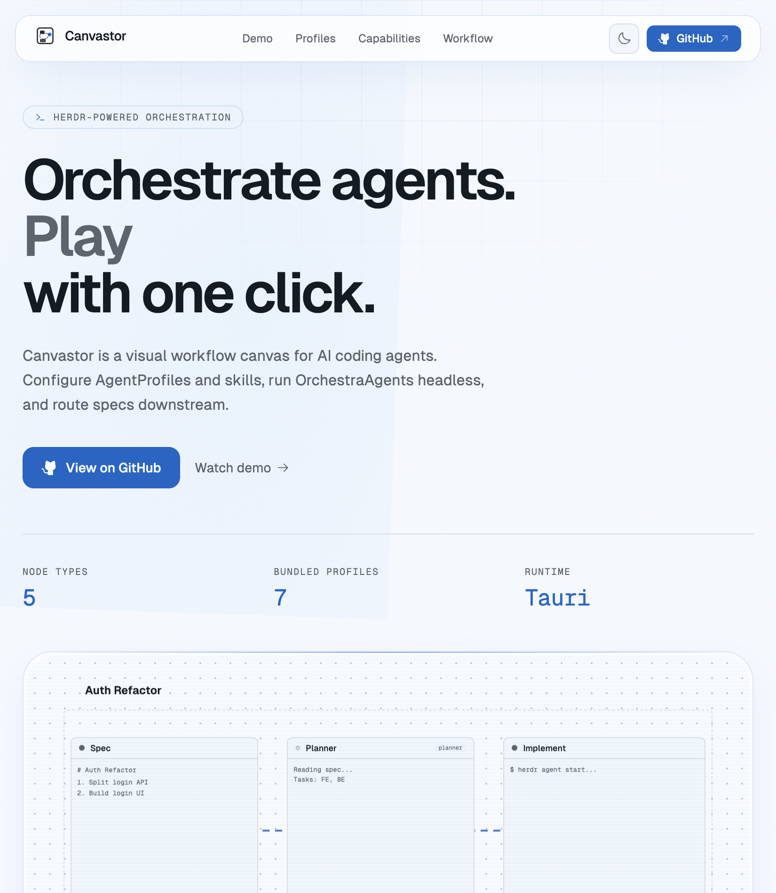
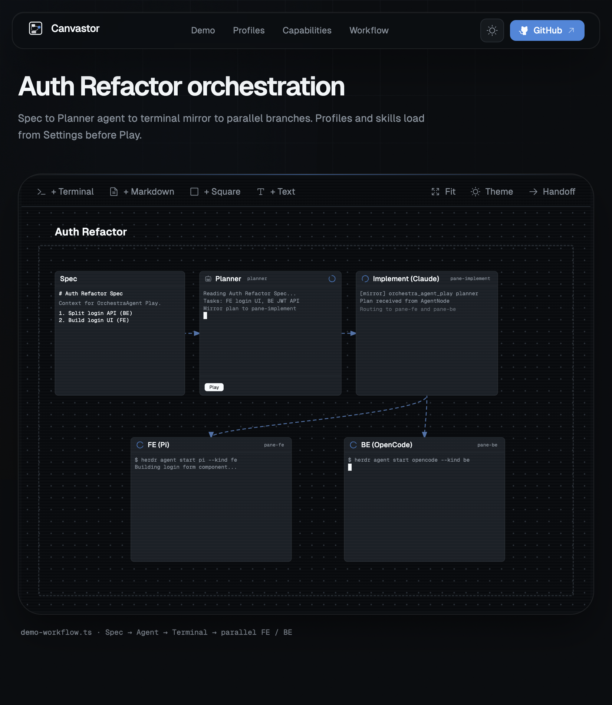
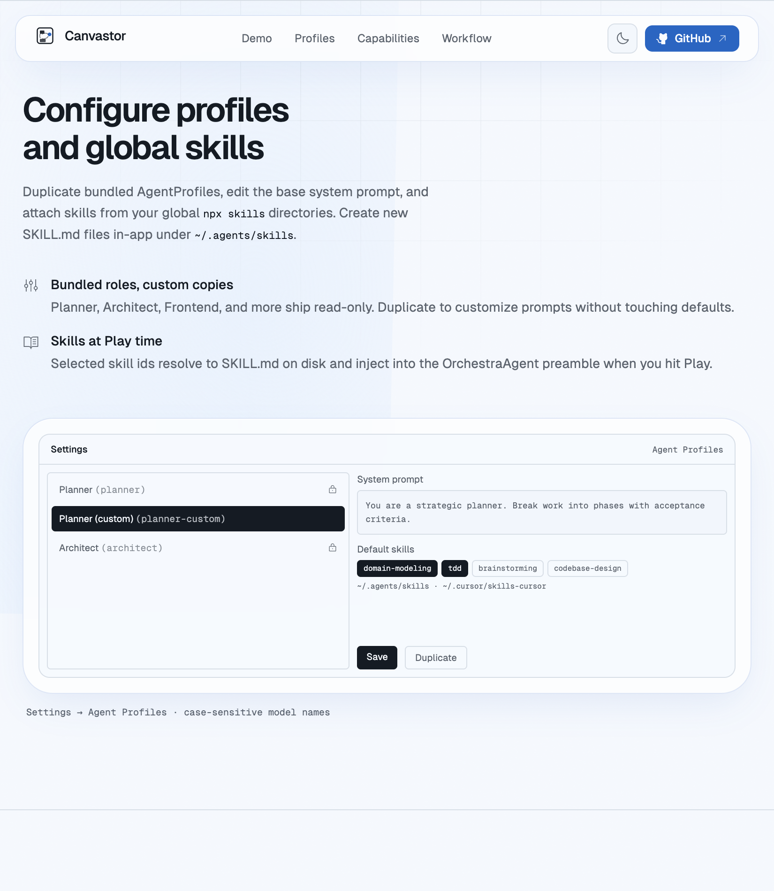

# Canvastor Landing Page

Static marketing site for [Canvastor](https://github.com/m4har/canvas-terminal-orchestration).



## Screenshots

| Hero | Auth Refactor orchestration (dark) | Agent Profiles |
|---|---|---|
|  |  |  |

## Local development

```bash
cd landing
npm install
npm run dev
```

Open http://localhost:5173

## Build

```bash
npm run build
npm run preview
```

From the repo root:

```bash
npm run build:landing
```

Shared brand assets (`CanvastorLogo`, design tokens, demo layout) are vendored into `landing/src/` via `npm run sync:tokens` so Railway can build with **Root Directory** set to `landing` only.

## Deploy to Railway

1. Create a new Railway project
2. Connect this repository
3. Set **Root Directory** to `landing`
4. Railway reads `nixpacks.toml` (Node 20) and `railway.toml`:
   - **Build:** `npm install && npm run build`
   - **Start:** `npx serve dist -s -l $PORT`
5. Deploy

Requires **Node 20+** (Tailwind CSS 4 / `@tailwindcss/oxide`).

The `-s` flag enables SPA fallback (all routes serve `index.html`).

## Stack

- Vite 6 + React 19
- Tailwind CSS 4
- Geist fonts, Phosphor icons
- Animated CSS mock of the Auth Refactor demo workflow
